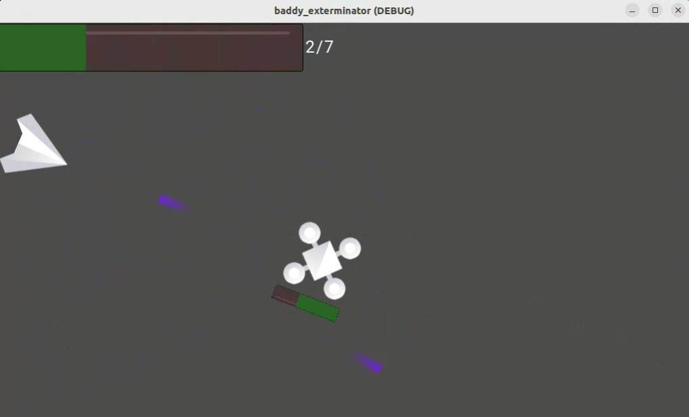

# Baddy Exterminator

**Baddy Exterminator** is a 2D topdown shooter game made with the Godot Engine. The goal is to escape the war zone after collecting all the keys necessary in the level.

Currently the game is not in its complete form, and only basic features (such as movement and shooting) are implemented.

## About the Project

The game have been made with **Godot v 3.5.1**. Additionally to complete the software used a few other ressources :

* **2D Sprites**: Most of them are from [kenney space assets](https://www.kenney.nl/assets/simple-space)
* **Image Edit**: For this I used **Inkscape**
* **Editor** : A combination of **VS Code** and **Godot Editor**

## How to Play

As of now, there is no executable release. I think in a near future, I will release a playable version on [Itch.io](https://itch.io/)

In anycase, the only way to play the game is through the **Godot Editor**. So first download and install the [Godot Engine](https://godotengine.org/download). Then clone this repository `git clone https://github.com/yayolande/baddy-exterminator-godot`. Finally, launch the Godot Engine and import it. Once successful, you can run the Project.

